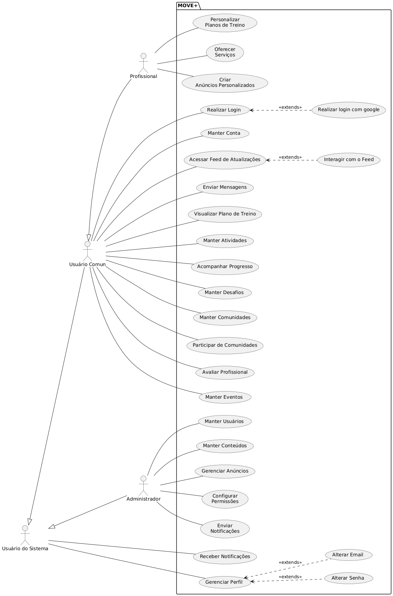

# Capa

---

<h2>Visão de Casos de Uso</h2>

<h3>MOVE+</h3>

---

## Histórico de revisões

|    Data    | Versão |      Descrição       |
| :--------: | :----: | :------------------: |
| 25/09/2024 |  0.1   | Criação do documento |

---

# Introdução

A visão de casos de uso exibe as funcionalidades do sistema e como elas são percebidas pelos usuários enquanto atores que interagem com o sistema.

## Quem usa estas informações?

- Cliente
- Designers
- Desenvolvedores
- Testadores
- Gerentes de projeto

# Visão geral

## Atores

## Sistema

