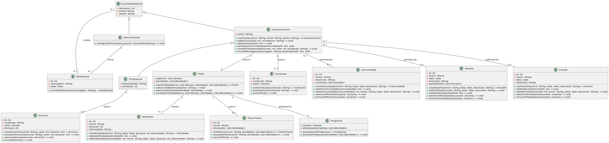

<h2>Visão Lógica</h2>

<h3>MOVE+</h3>

---

## Histórico de revisões

|    Data    | Versão |      Descrição       |                     Autores                     |
| :--------: | :----: | :------------------: | :---------------------------------------------: |
| 01/10/2024 |  0.1   | Criação do documento | Lavinia Rodrigues, Rafael Bueno e Raiza Andrade |

---

# Introdução

A visão lógica descreve a estrutura e organização do sistema, enfatizando como os componentes interagem entre si e como os dados fluem através dele. Essa perspectiva abstrai os detalhes de implementação, permitindo uma compreensão clara das funcionalidades e das relações entre as entidades. A visão lógica serve como uma base fundamental para o desenvolvimento do sistema, orientando a modelagem e a comunicação entre os stakeholders.

## Quem usa estas informações?

- Cliente
- Designers
- Desenvolvedores
- Testadores
- Gerentes de projeto

## Diagrama de Classes

## Diagrama de Pacotes

