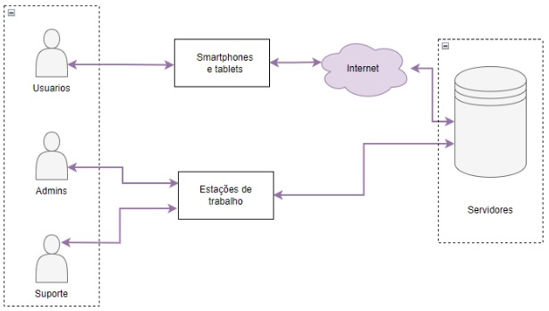

# Visão do Produto
## MOVE+
### Versão 1.0

**Equipe:** Lavínia Rodrigues Morais | Rafael Limeira de Castro Bueno | Raiza Andrade de Freitas Tomazoni

## Introdução
O Documento de Visão do Produto (DVP) descreve o aplicativo MOVE+, uma rede social dedicada a conectar pessoas interessadas na prática de exercícios físicos e vida saudável. Este documento define o problema que o aplicativo busca resolver, as principais necessidades dos stakeholders, as funcionalidades do sistema, as restrições do projeto, entre outros aspectos.

## Propósito
O objetivo deste documento é reunir, analisar e definir as características e necessidades de alto nível do sistema MOVE+. Ele foca nos recursos essenciais para stakeholders e usuários e nas justificativas para essas necessidades. As especificações de casos de uso e os requisitos funcionais fornecem detalhes sobre como o MOVE+ atenderá a essas necessidades, garantindo uma experiência valiosa para todos os usuários.

## Escopo do Produto
O MOVE+ é um sistema voltado para conectar pessoas que praticam atividades físicas, promovendo a troca de ideias, a busca por profissionais especializados, dicas sobre produtos, informações sobre eventos esportivos e sugestões gerais para uma vida saudável.

## Posicionamento
### Oportunidade de negócios
O MOVE+ apresenta várias oportunidades de negócios, tais como:

- #### Serviço de assinatura:
  **Descrição**  
  Implementação de uma assinatura premium que oferece aos usuários acesso a recursos avançados e funcionalidades adicionais da plataforma. Esses recursos incluem planos de treino personalizados, relatórios de progresso 
  detalhados, e consultorias exclusivas com profissionais especializados.

  **Oportunidade**  
  Criação de um fluxo de receita recorrente através de taxas de assinatura mensal ou anual, aumentando o valor percebido da plataforma e incentivando a fidelidade dos usuários.

- #### Parcerias com profissionais:
  **Descrição**  
  Estabelecimento de parcerias com academias, personal trainers e outros profissionais de educação física. A plataforma permitirá que esses profissionais ofereçam seus serviços diretamente, proporcionando um canal para    
  maior visibilidade e interação com potenciais clientes.

  **Oportunidade**  
  Ampliação da base de usuários e diversificação das ofertas da plataforma. Possibilidade de comissões sobre serviços vendidos ou taxas de assinatura para profissionais que desejam listar seus serviços no MOVE+.

- #### Publicidade Direcionada:
  **Descrição**  
  Espaço para anúncios segmentados dentro da plataforma, permitindo que marcas de suplementos, equipamentos de treino, roupas esportivas e outros produtos relacionados à prática de esportes alcancem um público altamente 
  segmentado e interessado.

  **Oportunidade**  
  Venda de espaço publicitário com base em CPM (custo por mil impressões) e CPC (custo por clique), gerando receita contínua.

- #### Gamificação e Recompensas:
  **Descrição**  
  Implementação de um sistema de pontos e recompensas por participação em desafios, compartilhamento de conteúdo e interação com a comunidade.
  
  **Oportunidade**  
  Aumento do engajamento e da retenção de usuários, além de oportunidades para parcerias com marcas que podem oferecer prêmios e recompensas.

# Descrição dos Benefícios para os Clientes e dos Problemas Resolvidos

## Benefícios

| Benefícios                                   | Problemas Resolvidos                                          | Afetados                                        |
|----------------------------------------------|-------------------------------------------------------------|-------------------------------------------------|
| Conexão com a comunidade                     | Isolamento e falta de motivação ao praticar atividades físicas | Usuários que buscam uma rede de apoio           |
| Acesso facilitado a profissionais especializados | Dificuldade em encontrar e conectar-se com profissionais específicos | Usuários que procuram orientação especializada   |
| Personalização de experiência                 | Falta de conteúdo relevante e específico para cada usuário    | Usuários que desejam uma experiência adaptada   |
| Motivação por desafios                        | Falta de engajamento e consistência em rotinas de exercícios  | Usuários que precisam de motivação               |
| Economia de tempo                            | Necessidade de usar múltiplos aplicativos para diferentes aspectos de rotina saudável | Usuários que buscam praticidade                 |
| Oportunidades de networking                  | Dificuldade em encontrar profissionais e eventos locais       | Usuários que buscam conexões profissionais       |
| Monitoramento e registro de progresso do usuário | Dificuldade em acompanhar e manter registro de treinos de forma organizada | Usuários que desejam ter controle sobre sua evolução |

# Descrição dos Stakeholders e dos Usuários

Esta seção descreve os stakeholders e os usuários do Sistema MOVE+.

## Stakeholders

Segue abaixo a lista de stakeholders.

| Stakeholder               | Descrição                                                                 | Papel                |
|--------------------------|---------------------------------------------------------------------------|---------------------|
| Cliente                  | Responsável pela contratação do desenvolvimento do aplicativo MOVE+      | Contratante         |
| Usuários                 | Indivíduos que utilizam o MOVE+ para compartilhar experiências, buscar informações sobre prática de atividades físicas e interagir com a comunidade. | Usuário do sistema   |
| Parceiros Profissionais   | Academias e personal trainers que oferecem seus serviços através do MOVE+. | Provedores de serviços |
| Equipe de Desenvolvimento | Profissionais responsáveis pelo design, desenvolvimento e manutenção contínua da plataforma. | Desenvolvedores      |
| Gerente de Projeto        | Profissional responsável por supervisionar o projeto, garantindo que o aplicativo seja desenvolvido dentro do prazo e orçamento estabelecidos. | Gerente de Projeto   |

## Usuários e Atores

Segue tabela com os usuários e atores do sistema:

| Usuário/Atores | Descrição | Responsabilidades | Stakeholders |
|----------------|-----------|-------------------|--------------|
| Usuários (Atletas e Entusiastas de Atividades Físicas) | Indivíduos que utilizam o aplicativo para trocar informações, dicas e experiências relacionadas a esportes e saúde. | Criar e personalizar perfis, participar de grupos e comunidades, compartilhar e consumir conteúdo, acompanhar eventos e desafios. | |
| Profissionais de Educação Física e Prática de Esportes | Personal trainers e outros especialistas que utilizam o aplicativo para oferecer serviços e consultoria.      | Criar perfis profissionais, compartilhar conteúdo especializado, interagir com usuários, e oferecer serviços e consultorias. ||
| Administrador do Sistema | Profissional responsável por gerenciar e manter o sistema. | Gerenciar usuários e acessos, realizar backups, monitorar o desempenho, e garantir a segurança e integridade do sistema. | Equipe de Desenvolvimento, Gerente de Projeto |
# Descrição do Ambiente de Uso

## Ambiente de Uso

O sistema MOVE+ pode ser utilizado em diversos ambientes, como:

### Ambiente do Usuário

Neste ambiente, o MOVE+ é utilizado pelos usuários para gerenciar suas rotinas de exercícios, interagir com a comunidade e acessar conteúdos especializados. Os usuários podem acessar o aplicativo através de dispositivos móveis, como smartphones e tablets. O aplicativo está disponível para os sistemas operacionais Android e iOS. O acesso ao ambiente do usuário é feito via internet e requer um login e senha.

### Ambiente dos Profissionais

Neste ambiente, o MOVE+ é utilizado por academias, personal trainers e outros profissionais de educação física para oferecer seus serviços diretamente aos usuários da plataforma. Os profissionais podem acessar o aplicativo através de dispositivos móveis, como smartphones e tablets. O aplicativo está disponível para os sistemas operacionais Android e iOS. Eles têm acesso a funcionalidades específicas, como a criação de perfis profissionais, oferta de serviços e interações com os usuários. O acesso a este ambiente também requer um login e senha.

### Ambiente Administrativo

Neste ambiente, o sistema é utilizado pelos administradores para gerenciar e manter o MOVE+. Os administradores podem acessar o sistema através de um navegador web em um computador e têm acesso a recursos de gerenciamento, como gerenciamento de usuários, moderação de conteúdos, e análise de dados. O acesso a este ambiente é feito por meio de login e senha específicos para funções administrativas.

### Ambiente de Teste

Neste ambiente, o MOVE+ é utilizado para testar novas funcionalidades e corrigir bugs antes de serem liberados para os usuários finais. O ambiente de teste é acessado através de um navegador web em um computador e requer um login e senha específicos para o ambiente de teste. Este ambiente é utilizado para garantir que as atualizações e melhorias sejam implementadas corretamente antes de sua liberação para o ambiente de produção.

# Necessidades Principais Quanto ao Ambiente

A seguir, é apresentada uma tabela que descreve as necessidades dos clientes com relação à qualidade, desempenho, segurança, usabilidade e confidencialidade do MOVE+, juntamente com sua prioridade, interesse, solução atual e soluções propostas:

| Necessidade                                                                                                       | Prioridade | Interesse                                                                                                                                                   | Soluções Propostas                                                                                                                                                                                                                   |
|-------------------------------------------------------------------------------------------------------------------|------------|------------------------------------------------------------------------------------------------------------------------------------------------------------|---------------------------------------------------------------------------------------------------------------------------------------------------------------------------------------------------------------------------------------|
| Qualidade: O sistema deve ser confiável e livre de erros, bugs e falhas.                                        | Alta       | Os usuários esperam que o sistema funcione corretamente e não apresente erros que possam prejudicar o seu uso no dia a dia.                             | Implementar testes automatizados e processos de garantia de qualidade para identificar e corrigir erros e bugs.                                                                                                                  |
| Desempenho: O sistema deve ter um bom desempenho, com tempo de resposta rápido e sem atrasos significativos.      | Alta       | Os usuários esperam que o sistema responda rapidamente às suas interações, como ao carregar postagens, buscar profissionais e participar de desafios.      | Projetar uma boa arquitetura do sistema para garantir melhor desempenho e escalabilidade, bem como otimizar consultas de banco de dados e uso de recursos do sistema.                                                                 |
| Escalabilidade: O sistema deve ter capacidade para suportar o crescimento do número de usuários e interações.     | Alta       | Os usuários esperam que o sistema continue funcionando de forma confiável e sem atrasos, mesmo com o aumento do número de usuários ativos.                 | Implementar arquitetura em nuvem e balanceamento de carga para garantir a escalabilidade do sistema.                                                                                                                                 |
| Segurança: O sistema deve ser seguro, protegido contra acesso não autorizado, invasões e roubo de dados.           | Alta       | Os usuários esperam que suas informações estejam seguras e protegidas contra invasões e acesso não autorizado.                                           | Implementar medidas de segurança, como autenticação de dois fatores, certificados SSL e criptografia avançada.                                                                                                                     |
| Usabilidade: O sistema deve ser fácil de usar e entender, com uma interface intuitiva e amigável ao usuário.      | Alta       | Os usuários esperam que o sistema seja fácil de usar, permitindo que naveguem e interajam sem dificuldades, mesmo sem conhecimento técnico avançado.      | Realizar testes de usabilidade com usuários reais para identificar áreas de melhoria e implementar melhorias na interface do usuário.                                                                                               |
| Confidencialidade: O sistema deve proteger a privacidade e confidencialidade das informações dos usuários.        | Alta       | Os usuários esperam que suas informações pessoais, preferências e atividades sejam mantidas em sigilo e protegidas contra acesso não autorizado.           | Realizar auditorias de segurança e implementar medidas adicionais de privacidade e proteção de dados, como política de privacidade clara e concisa, consentimento explícito do usuário para coleta e uso de dados, e implementação de protocolos de segurança avançados. |
| Tempo de resposta: O sistema deve ter um tempo de resposta rápido para que os clientes possam acessar e controlar suas garantias de forma eficiente. | Moderada   | Os clientes esperam que o sistema responda às suas solicitações rapidamente para que possam gerenciar suas garantias de forma mais eficiente.             | Realizar otimizações de performance, como o uso de cache, e garantir que o sistema esteja sempre atualizado para obter um tempo de resposta rápido.                                                                                     |

# Visão Geral do Produto

## Visão Geral
O sistema MOVE+ é uma rede social voltada para exercícios físicos, esportes e bem-estar. Ele serve como uma plataforma onde usuários podem compartilhar experiências, trocar dicas e participar de desafios relacionados a atividades físicas e saúde. Além disso, o aplicativo conecta praticantes com profissionais do setor, permitindo a oferta de serviços personalizados e consultorias. A plataforma também disponibiliza funcionalidades avançadas para usuários que optam por uma assinatura premium, ampliando ainda mais as possibilidades de interação e suporte na busca por uma vida mais ativa e saudável.

Como o sistema MOVE+ é um software, sua estrutura operacional é baseada em uma infraestrutura de TI, em vez de hardware específico. A infraestrutura necessária para operar o MOVE+ inclui servidores, banco de dados, e dispositivos de rede, como roteadores e switches.

O MOVE+ pode ser acessado por meio de dispositivos móveis que possuam acesso à Internet, como tablets e smartphones. Isso permite que os usuários acessem e interajam com a plataforma de qualquer lugar e a qualquer momento, seja para acompanhar suas rotinas, participar de desafios ou se conectar com outros membros da comunidade.

A interação entre os dispositivos ocorre por meio de uma conexão de rede, geralmente a Internet. O servidor que hospeda o MOVE+ se comunica com os dispositivos dos usuários por meio de solicitações HTTP e respostas, permitindo que o sistema exiba informações e interaja de forma eficiente e fluida com o usuário.

Uma estrutura operacional do produto é apresentada na Figura 1.

# Custo e Venda

## Desenvolvimento de Software
- **Equipe de Desenvolvimento:** R$ 300.000,00
- **Infraestrutura Inicial:** R$ 50.000,00
- **Licenciamento e Ferramentas:** R$ 20.000,00
- **Total do Desenvolvimento:** R$ 370.000,00

## Assinatura de Suporte Técnico e Manutenção
- **Custo Mensal de Suporte:** R$ 10.000,00 (aumento devido a suporte técnico mais abrangente e melhor atendimento)

## Infraestrutura Operacional
- **Custo Mensal de Infraestrutura (servidores, banco de dados, etc.):** R$ 5.000,00 (aumento devido à necessidade de uma infraestrutura mais robusta)
- **Total Mensal de Suporte e Infraestrutura:** R$ 15.000,00

## Licenciamento e Instalação
O MOVE+ será licenciado para a cliente Maria Flor, permitindo sua instalação em servidores próprios ou na nuvem, conforme os requisitos técnicos. A instalação será de responsabilidade da equipe de desenvolvimento, que realizará a configuração dos servidores e da base de dados.

A equipe técnica fornecerá login e senha para acesso ao sistema após a instalação, garantindo que o MOVE+ esteja pronto para uso com todas as funcionalidades.

## Características e Funcionalidades de Alto Nível
Esta seção define e descreve as características do MOVE+. Trata-se dos requisitos de alto nível do sistema que são necessários para propiciar benefícios aos usuários.

- O sistema deve permitir que usuários criem perfis personalizados, incluindo informações como objetivos de saúde, histórico de atividades e preferências pessoais.
- O sistema deve permitir o cadastro de usuários e profissionais especializados, incluindo informações detalhadas sobre suas especialidades, áreas de atuação e interesses.
- O sistema deve oferecer a opção de adicionar fotos, treinos favoritos e metas pessoais no perfil.
- O sistema deve facilitar a criação e participação em grupos de interesse, como comunidades de corredores, praticantes de yoga ou entusiastas de musculação.
- O sistema deve permitir a interação dentro dos grupos por meio de fóruns, chats e compartilhamento de conteúdo.
- O sistema deve permitir que usuários registrem e compartilhem suas rotinas de treinos, incluindo tipos de exercícios, duração e intensidade.
- O sistema deve oferecer a possibilidade de criar e compartilhar relatórios de progresso e conquistas com outros usuários.
- O sistema deve disponibilizar um feed de atualizações com artigos, vídeos e dicas relacionadas a saúde e bem-estar.
- O sistema deve oferecer acesso a planos de treino e sugestões de atividades baseadas nas preferências e histórico do usuário.
- O sistema deve oferecer a possibilidade de participar de desafios e competições dentro da plataforma para incentivar a atividade física e o engajamento.
- O sistema deve enviar notificações aos usuários sobre atividades, desafios, eventos esportivos próximos e atualizações de amigos ou profissionais que eles seguem, para incentivá-los a manterem uma rotina ativa e saudável.
- O sistema deve permitir o registro e a visualização de eventos esportivos locais e online, e a inscrição em eventos promovidos pela plataforma.
- O sistema deve permitir o acompanhamento do status das rotinas de treinos e progressos dos usuários, incluindo a possibilidade de registrar e compartilhar experiências, metas alcançadas e interações com outros usuários.
- O sistema deve garantir a segurança das informações pessoais e de saúde dos usuários, com acesso restrito, criptografia e controle de permissões de acesso a dados sensíveis.
- O sistema deve ter uma interface de usuário amigável e intuitiva, para que os usuários possam acessar facilmente as funcionalidades, se conectar com outros membros e acompanhar suas rotinas sem dificuldade.
- O sistema deve ter um desempenho satisfatório, com tempos de resposta rápidos, carregamento eficiente de conteúdos e estabilidade, sem interrupções ou falhas.
- O sistema deve ser escalável para suportar um crescente número de usuários e interações, sem comprometer o desempenho ou a qualidade da experiência do usuário.
- O sistema deve ser bem documentado e o código-fonte deve estar disponível para auditoria e manutenção futura, garantindo a continuidade e a possibilidade de melhorias no longo prazo.

